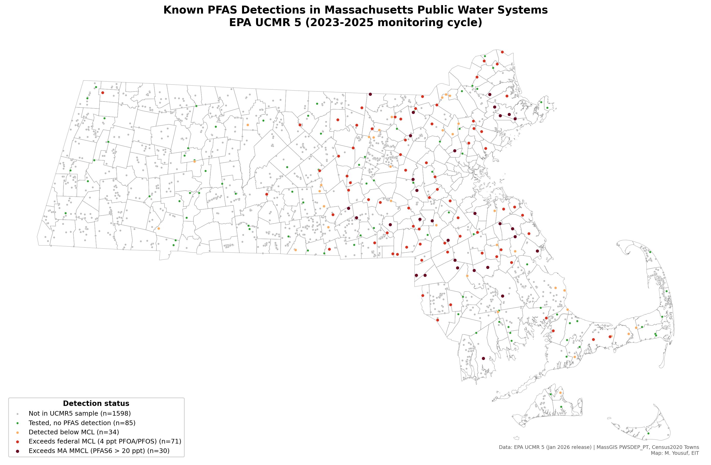
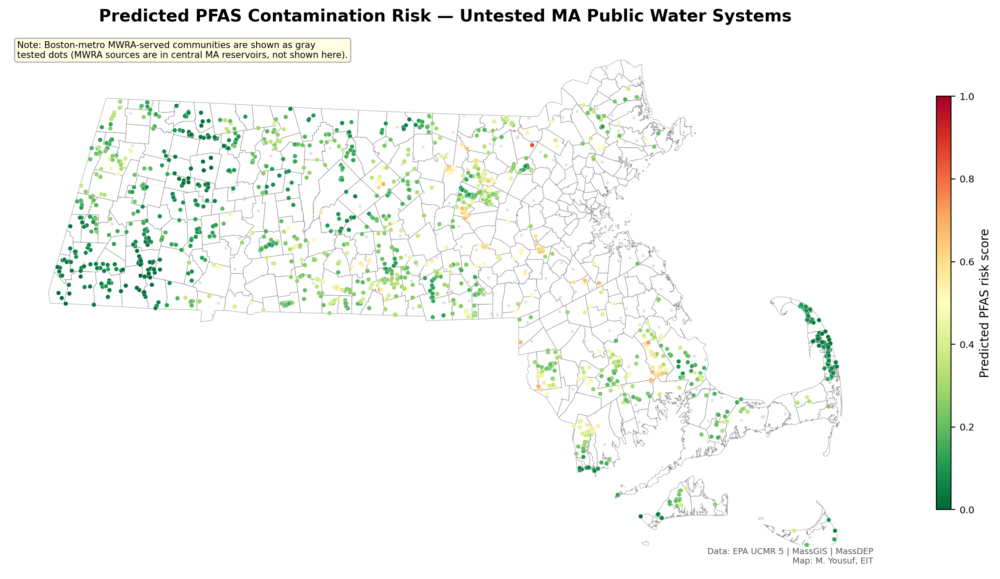
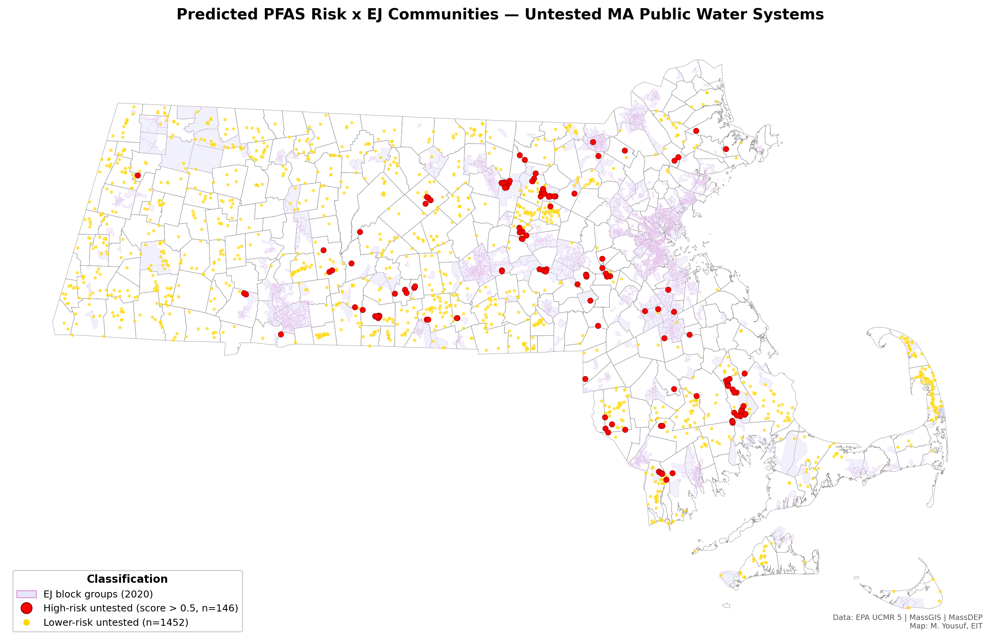
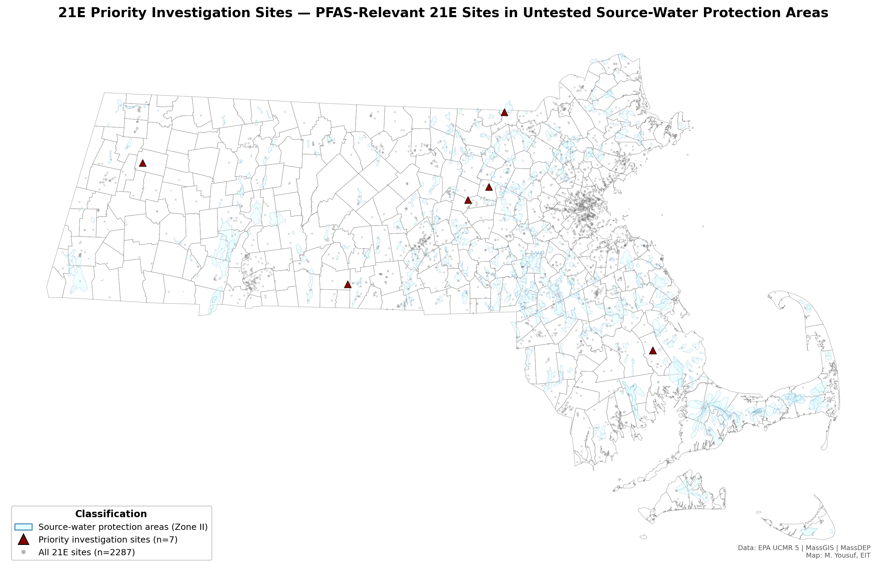

# Massachusetts PFAS Contamination Risk Prediction & Environmental Justice Analysis

An interactive screening tool for Massachusetts public water systems that
combines EPA UCMR 5 monitoring data with proximity-based risk modeling,
MassDEP 21E contaminated-site cross-referencing, and state-defined
environmental justice criteria to identify high-priority untested systems.

## Key findings

- **143 of 263** UCMR 5–tested Massachusetts public water systems had at
  least one PFAS detection (54%).
- **106 systems** ever exceeded the federal PFOA/PFOS MCL of 4 ppt, and
  **34 systems** exceeded the Massachusetts PFAS6 MMCL of 20 ppt.
- The risk-prediction model (logistic regression, 5-fold CV AUC 0.60,
  test AUC 0.89) identified **142 untested systems as high risk** and an
  additional **4 as very high risk** out of 1,598 scored.
- **Seven MassDEP 21E contaminated sites** with PFAS-relevant histories
  fall inside the Zone II or IWPA source-water protection area of an
  untested Massachusetts public water system.
- **Untested systems serving environmental-justice communities are 5.3×
  more likely to be classified high risk** than those serving non-EJ
  communities (42.9% vs 8.1%; χ² = 65.1, p < 0.0001; Mann-Whitney U
  p < 0.0001).

## Maps

### Map 1 — Known PFAS detections


### Map 2 — Predicted risk for untested systems


### Map 3 — Risk × environmental-justice overlay


### Map 4 — 21E priority investigation sites


## Methodology

### Data sources

| Dataset | Source |
|---|---|
| PFAS monitoring results | [EPA UCMR 5](https://www.epa.gov/dwucmr/occurrence-data-unregulated-contaminant-monitoring-rule) (Jan 2026 release) |
| PWS source locations | [MassGIS PWSDEP_PT](https://www.mass.gov/info-details/massgis-data-public-water-supplies) |
| PWS service-area polygons | [MassGIS PWS Water Service Areas](https://www.mass.gov/info-details/massgis-data-massdep-estimated-public-drinking-water-system-service-area-boundaries) |
| Environmental-justice populations | [MassGIS EJ 2020](https://www.mass.gov/info-details/massgis-data-2020-environmental-justice-populations) |
| 21E contaminated sites | [MassDEP Tier Classified 21E Sites](https://www.mass.gov/info-details/massgis-data-massdep-tier-classified-21e-sites) |
| Zone II / IWPA protection areas | [MassGIS DEP-Approved Wellhead Protection Areas](https://www.mass.gov/info-details/massgis-data-dep-approved-wellhead-protection-areas-zone-ii) |
| Landfills | MassGIS Solid Waste Facilities (`SW_LD_POLY`) |
| POTW service areas (WWTP proxy) | MassGIS DEP Sewer Service Areas |
| Industrial dischargers | MassGIS BWP Major Polluters (`BWPMAJOR_PT`) |
| MWRA service territory | MassGIS `mwraservice` |
| Airports | [OurAirports](https://ourairports.com/data/), MA subset |
| Military installations | Hand-curated (7 MA sites) |

### Approach

1. **Data cleaning.** Standardized UCMR 5 results for Massachusetts
   (46,070 rows, 263 systems), imputed non-detects at half the minimum
   reporting level, converted µg/L to ng/L (ppt), and flagged federal
   MCL (PFOA/PFOS > 4 ppt) and MA MMCL (PFAS6 sum > 20 ppt) exceedances
   per sample and per system.

2. **Feature engineering.** Reprojected every layer to EPSG:26986 (MA
   State Plane, meters). For each of 1,818 MassGIS PWS source points,
   computed nearest-neighbor distance to the nearest airport, military
   installation, landfill, POTW service-area centroid, and major
   industrial discharger, plus counts of landfills/industrial sites
   within 1, 3, 5, and 10 km. Aggregated to per-PWSID by taking the
   closest source, and flagged MWRA-served systems via spatial join.

3. **Risk prediction.** Trained a logistic regression (and a random
   forest for comparison) on the 220 PWSs present in both UCMR 5 and
   the MassGIS source layer, with detection as binary target and
   distance features + groundwater flag + buffer counts as predictors.
   Class-balanced fit, stratified 80/20 test split, 5-fold CV. LR
   selected for interpretability. Applied to the 1,598 untested PWSs.

4. **21E cross-reference.** Spatially joined 2,287 MassDEP 21E sites
   into Zone II and IWPA protection polygons, keyword-scored the site
   name column for PFAS-relevant activity (AFFF / fire training, fuel
   / UST, dry cleaning, landfill, metal plating, military, etc.), and
   filtered to sites associated with an untested public water system.

5. **Environmental-justice analysis.** Overlaid PWS service-area
   polygons on the MassGIS 2020 EJ population block groups, computed
   per-PWS area-fraction overlap and criterion flags, then tested
   whether predicted-risk distributions differ between EJ and non-EJ
   service areas (chi-square on a high-risk × EJ contingency table and
   one-sided Mann-Whitney U).

### Important limitations

- **Screening-level only.** Not a risk assessment or compliance
  determination, and not a substitute for site-specific sampling.
- **Proximity is crude.** Distance-based features do not account for
  hydrogeologic transport, groundwater flow direction, or actual
  contaminant fate.
- **Small training set.** 220 PWSs, 5-fold CV AUC ≈ 0.60 — usable for
  prioritization, not prediction of specific concentrations.
- **MWRA systems have a fundamentally different risk profile.** MWRA
  source intakes are in central-MA reservoirs, 60+ miles from the
  Boston-metro communities they serve. They are included with an
  `is_mwra` flag but their distance features are not directly
  comparable to independent groundwater sources.
- **21E keyword flagging is imperfect.** The MassDEP schema has no
  structured contaminant column, so the search runs over site names
  only — expect both false positives (e.g., unrelated gas stations) and
  false negatives (unlabeled activity).
- **EJ overlay uses service-area polygons**, which are MassDEP estimates
  of served area, not parcel-level hookups.
- **Non-detect imputation at MRL/2** is standard but introduces
  uncertainty in concentration estimates.

See the [technical memo](report/pfas_technical_memo.pdf) for the
complete methodology and results discussion.

## Interactive application

A Streamlit app (`app/streamlit_app.py`) lets you select any MA town or
public water system and see PFAS detection status, predicted risk score,
nearest potential sources with distances, EJ overlap, and 21E priority
sites in the area. See `DEPLOYMENT.md` for Streamlit Community Cloud
setup.

## Repository structure

```
pfas-risk-ma/
├── app/                      # Streamlit application
│   ├── streamlit_app.py
│   ├── data/                 # Lightweight data for deployment
│   └── requirements.txt
├── data/
│   ├── raw/                  # Original downloaded datasets
│   └── cleaned/              # Processed analysis-ready data (.gpkg + .csv)
├── maps/                     # Static map outputs (PNG + PDF) + model plots
├── report/                   # Technical memo (.docx + .pdf)
├── scripts/                  # 01-12 numbered pipeline
├── .streamlit/config.toml
├── DEPLOYMENT.md
├── README.md
└── requirements.txt
```

## Reproduce this analysis

```bash
git clone https://github.com/<username>/pfas.git
cd pfas/pfas-risk-ma
pip install -r requirements.txt

# Run the pipeline in order
python scripts/01_clean_pfas_data.py
python scripts/02_preliminary_map.py
python scripts/03_standardize_layers.py
python scripts/04_distance_features.py
python scripts/05_21e_crossref.py
python scripts/06_ej_overlay.py
python scripts/07_prepare_model_data.py
python scripts/08_train_model.py
python scripts/09_predict_risk.py
python scripts/10_ej_disparity_test.py
python scripts/11_maps_2_3_4.py
python scripts/12_prepare_app_data.py

# Launch the app locally
streamlit run app/streamlit_app.py
```

## Author

**Maahum Yousuf, EIT** · Boston, MA

## License

Code available under the MIT License. Underlying data (EPA, MassGIS,
MassDEP) is public domain.
